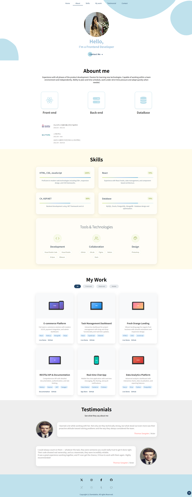
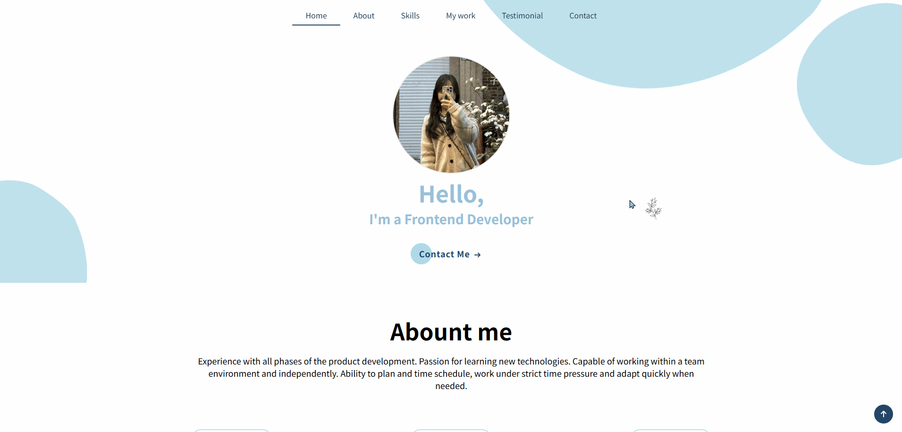
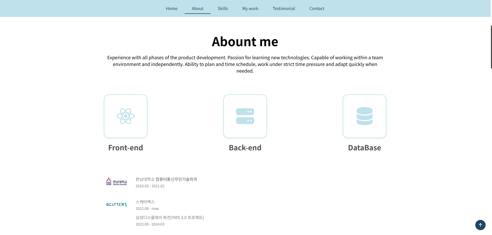
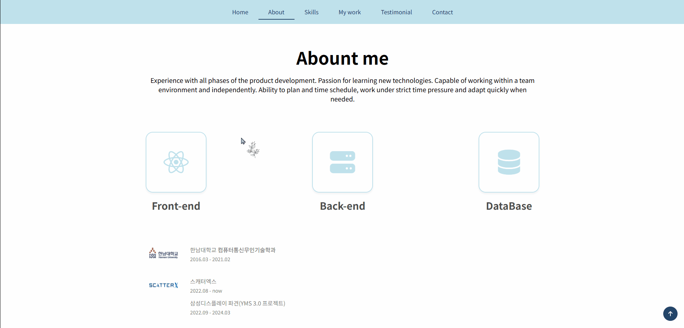
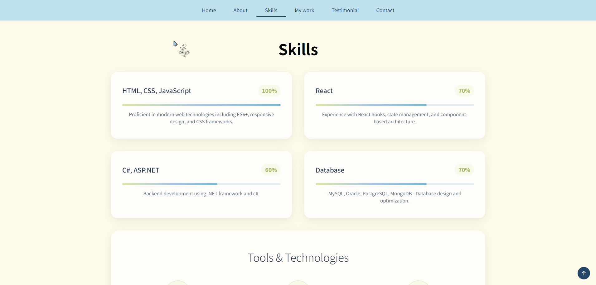
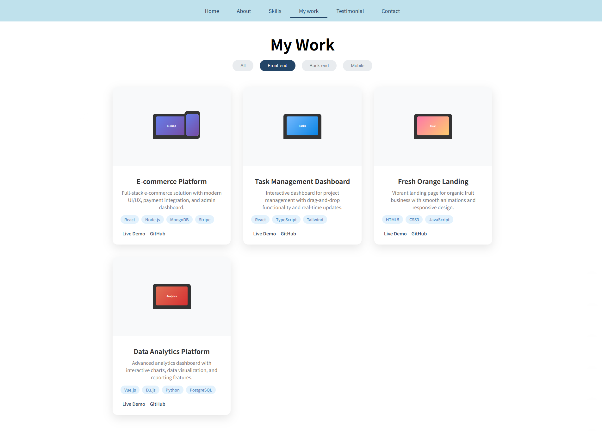
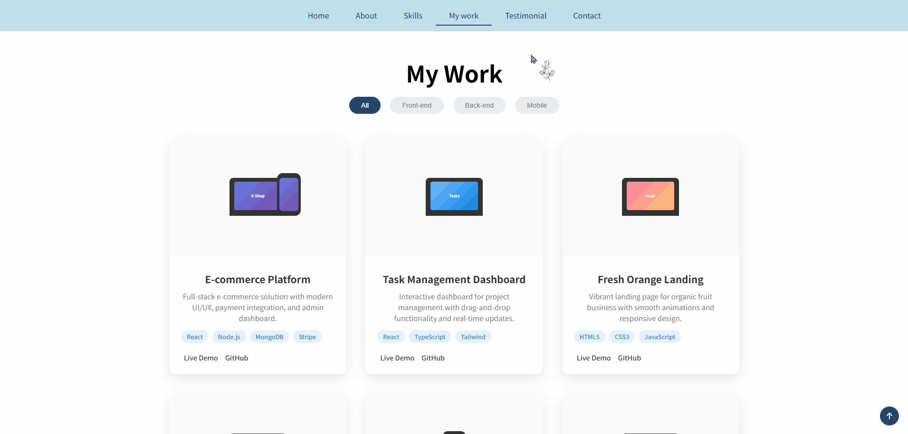
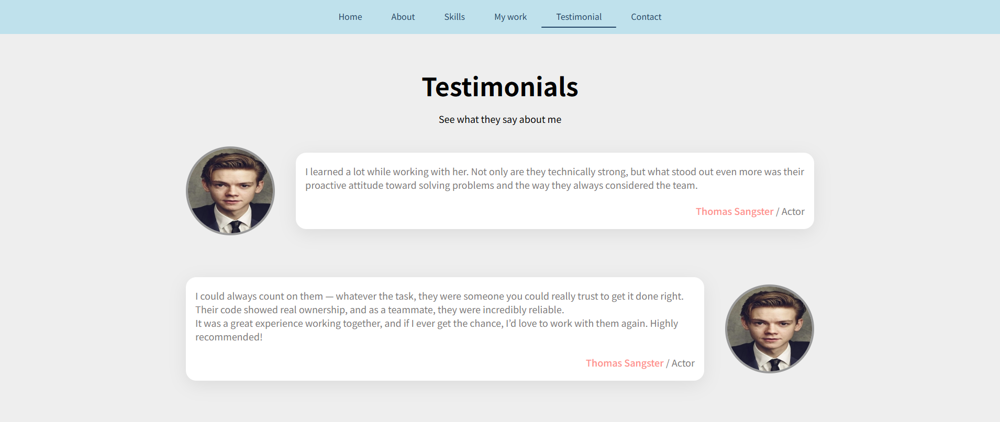

# 개인 포트폴리오
 
 
 

## 💡 화면 구성

 
<h3 style="display:inline; margin-left:4px">1️⃣ Home</h3>

 <h4>📷 이미지</h4>
 
 <h4>📽 동영상</h4>
 

 
<h3 style="display:inline; margin-left:4px">2️⃣ About</h3>

 <h4>📷 이미지</h4>
 
 <h4>📽 동영상</h4>
 

 
<h3 style="display:inline; margin-left:4px">3️⃣ Skills</h3>

 <h4>📷 이미지</h4>
 
 <h4>📽 동영상</h4>
 

 
<h3 style="display:inline; margin-left:4px">4️⃣ My Work(Mock Data)</h3>

 <h4>📷 이미지</h4>
 
 <h4>📽 동영상</h4>
 

 
<h3 style="display:inline; margin-left:4px">5️⃣ Testimonials(Mock Data)</h3>

 <h4>📷 이미지</h4>
 
 <h4>📽 동영상</h4>
 

 
<h3 style="display:inline; margin-left:4px">6️⃣ Contact</h3>

 <h4>📷 이미지</h4>
 
 <h4>📽 동영상</h4>
 

